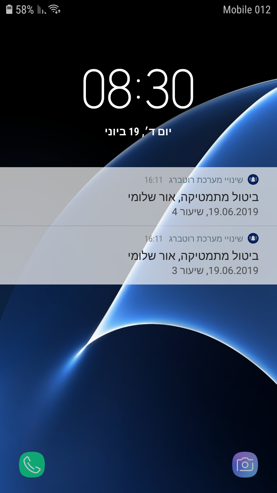
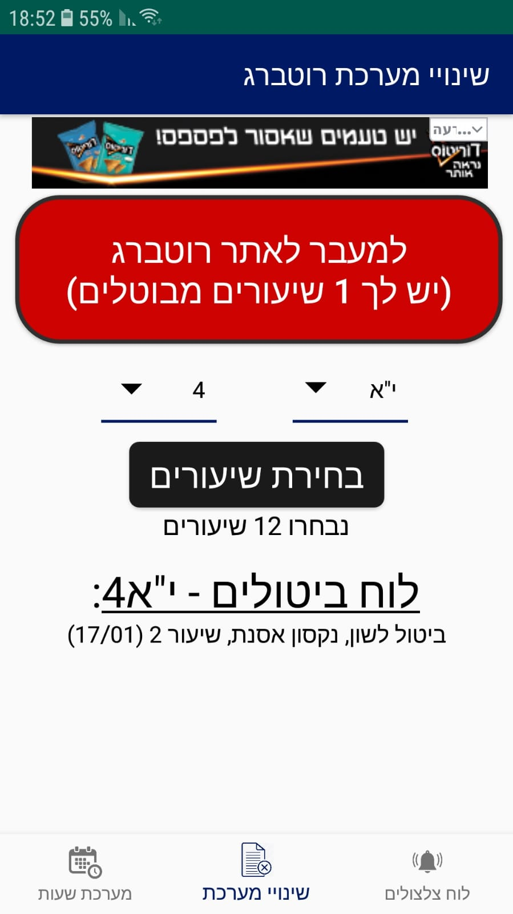
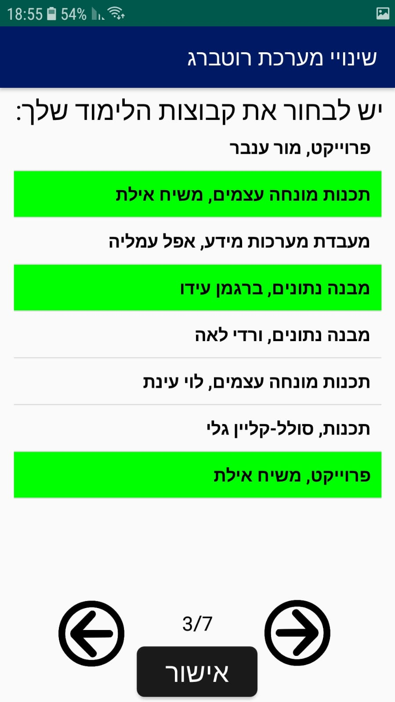
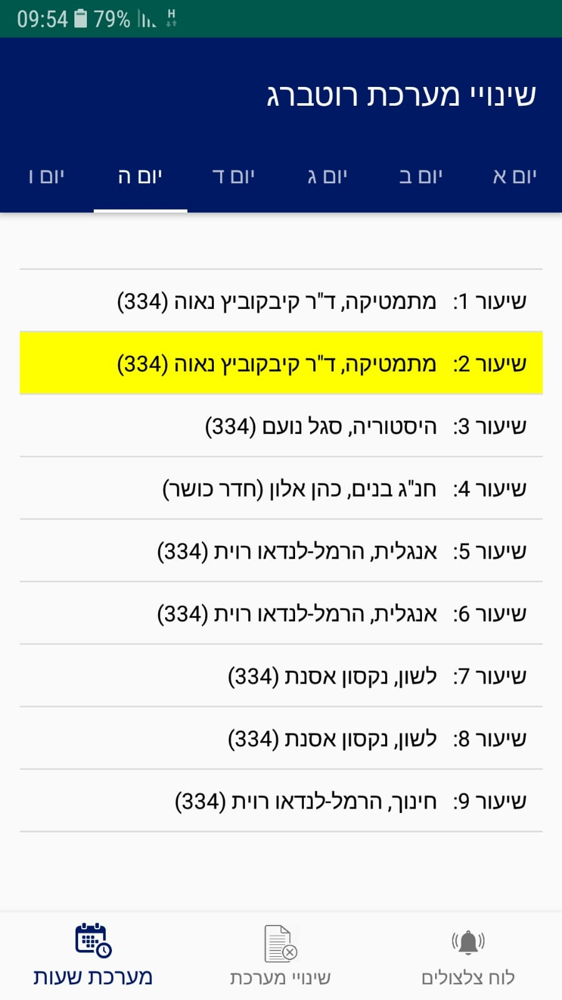
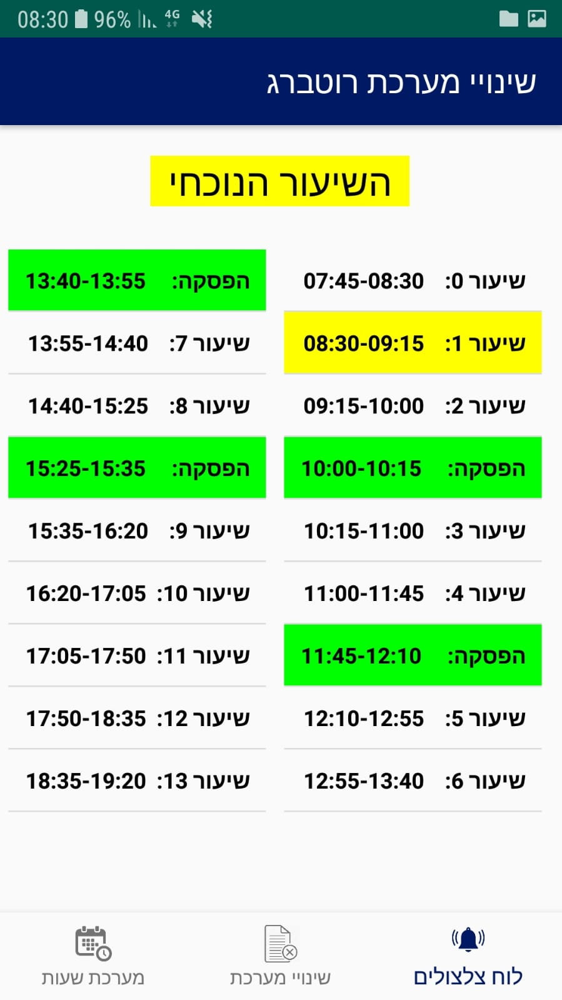

# cancel-alert-app
An android app that notifies the students in Rotberg high school when a lesson is canceled for them  in real-time (I made it in 10th grade).

Before I wrote this app, in order to check for schedule changes in our school, one had to enter the changes website and check it manually.
I have always wanted to be notified when a lesson is canceled *in real-time* and *automatically* so I started working on it...

Long story short, I contacted the schedule changes company and asked for their API, wrote a code in node.js that checks it all the time and sends this app notifications using 
Firebase Cloud Messaging.
Finally I uploaded the node.js code to heroku and [published this app at google play](https://play.google.com/store/apps/details?id=com.myapp.cancelalert)

When I wrote this app I was inexperienced with android development, and I wanted to deploy it as fast as possible. 
It reflects in the code...

Some screenshots:

{:height="50%" width="50%"}

In the beginning of 11th grade, I updated this app and added the following things:
- The ability to select specific lessons that you learn (there are different study groups inside each class)
- A view of your schedule table that corresponds to the lesson you selected.
- Ringings board.

